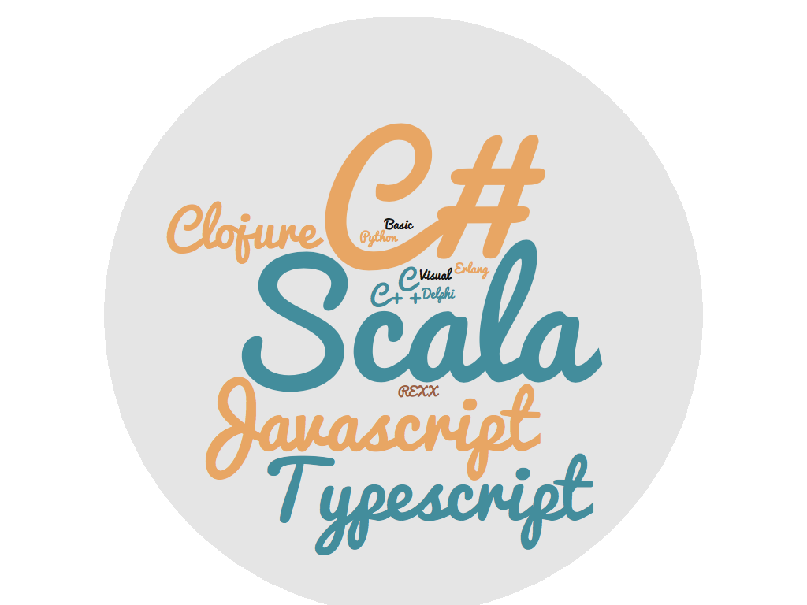

---

##*jobs:*
###Software Engineer & Agile Coach_@Hyperfar inc_

## *communities:*
### Ugidotnet **|** Scala Milano Meetup **|** Marketers

## *slide & code:* 
### https://github.com/rucka/workingsoftware2019


---

## October 01, 2012


---

##what
###**Typescript**
###is? 🧐
---

##is
###**Typescript == WEB + ❎**
###? 🤠
---
##is
###**Typescript == WEB + C#**
###? 🤔

---

##Non-Goal [^1]

- Exactly mimic the design of existing languages. Instead, use the behavior of JavaScript and the intentions of program authors as a guide for what makes the most sense in the language

[^1]: https://github.com/Microsoft/TypeScript/wiki/TypeScript-Design-Goals

---

##**Non**-Goal [^1]

- Exactly **mimic** the design of **existing languages**. Instead, **use the behavior of JavaScript** and the intentions of program authors as a guide for what makes the most sense in the language

---

## Goals [^1]
 - Align with current and future ECMAScript proposals.
 - Use a consistent, fully erasable, structural type system.

---

## Goals [^1]

 - **Align with** current and future **ECMAScript** proposals.
 - Use a consistent, fully erasable, **structural type system**.

^ EcmaScript spec stage 3 (candidate)

---

#####Use a consistent, fully erasable, **structural type system**


---

###Use a consistent, fully erasable, **structural type system**


---

##Use a consistent, fully erasable, **structural type system**


---

# **Structural type system**


---


---
<br>
<br>
<br>

#a k a


---

#Nominal typing

```csharp
class Foo {public string me;}
class Bar {public string me;}

Foo foo = new Foo(){me = "foo"};
Bar bar = foo; //<--
               //Error:
               //cannot implicit convert
               //type 'Foo' to 'Bar'
System.Console.WriteLine("I am "+ bar.me);

```


---

#Structural typing

```typescript
interface Foo { me: string }
interface Bar { me: string }

const foo: Foo = { me: 'foo' }
const bar: Bar = foo

console.log(`I am ${bar.me}`); //I am foo
```


---

#~~Typescript == WEB + C#~~

---

#Demo

#### Typescript: a gentle introduction


---


---

#Let's **play** with **types**


---
## Goals [^1]
- **Statically identify** constructs that are likely to be **errors**.

---

##1. parametric polimorphism[^2]

```ts
interface Valid<A> { a: A }
interface Invalid<E> { errors: E[] }

function save<A>(data: Valid<A>): void {
    alert(`${JSON.stringfy(data.a)} saved!`);
}

function showErrors<E>(data: Invalid<E>): void {
    alert(`${JSON.stringfy(data.errors)} :(`);
}
```


[^2]: https://en.wikipedia.org/wiki/Parametric_polymorphism

---

##2. union types

```ts
type Validated<E, A> = Valid<A> | Invalid<E>

type CustomerError =
  | NameIsEmpty
  | NameIsTooShort
  | VatCodeIsEmpty
  | VatCodeNotValid
  | EmailIsEmpty
  | EmailIsNotValid
  | WebsiteUrlNotValid
  | TermsNotAccepted
  
```

---

##3.1 discriminated (tagged) union

```ts
interface NameIsTooShort { kind: 'NameIsTooShort', name: string }
interface VatCodeNotValid { kind: 'VatCodeNotValid', vatcode: string }
interface EmailIsNotValid { kind: 'EmailIsNotValid', email: string }
interface WebsiteUrlNotValid { kind: 'WebsiteUrlNotValid', url: string }

type CustomerError = NameIsTooShort | VatCodeNotValid | EmailIsNotValid | WebsiteUrlNotValid

function errorMessage(e: CustomerError): string {
    switch (e.kind) {
        case 'NameIsTooShort': 
        return `Name must be at least 3 chars long, actual is ${e.name.length}`;
        case 'EmailIsNotValid': 
        return `Email address '${e.email}' is not valid`;
        case 'VatCodeNotValid': 
        return `VAT code '${e.vatcode}' is not valid`;
        case 'WebsiteUrlNotValid': 
        return `Url '${e.url}' is not valid`;
    }
}
```


---

##3.2 discriminated (tagged) union

```ts
function isValid<A>(arg: any): arg is Valid<A> {
return arg.a !== undefined;
}

// here validatedCustomer is Validated<E, Customer>
if (isValid(validatedCustomer)) { 
// here validatedCustomer is Valid<Customer>
return save(validatedCustomer); 
} else {
// here validatedCustomer is Invalid<E>
return showErrors(validatedCustomer);
}

```

---

##4. itersection types

```ts
type A = {a: number}
type B = {b: number}
type I = A & B
let x: I = {a: 1, b: 2}; // OK
x = {a: 1, c: "three"}; // Error:
// Object literal may only specify known properties, 
// and 'c' does not exist in type 'I'.
```

---
#Demo

#### **Fun**(ctional) **validation**


---


#### using Functional programming
### you are still **alive**
#### (maybe)


---


---

## under the hood...


---

### Algebraic data type[^3]
####(aka ADT)


[^3]: https://en.wikipedia.org/wiki/Algebraic_data_type

---

##Functor[^4]


[^4]: https://en.wikipedia.org/wiki/Functor

---

####(a sort of) 
##Monad[^5]


[^5]: https://en.wikipedia.org/wiki/Monad_(functional_programming)

---

##C# LINQ ❤️ Monad[^6] (`LiftA*`)
###`SelectMany` == `flatMap`
```csharp
var result =
    from r in rows
    from c in colums
    select "[" + r.Index + ", " + c.Index + "]";
    
var result = rows.SelectMany(r => 
	columns.SelectMany(c => 
		"[" + r.Index + ", " + c.Index + "]"));
```
[^6]: http://mikehadlow.blogspot.com/2011/01/monads-in-c-4-linq-loves-monads.html

---

####(a sort of) 
##Applicative[^7]


[^7]: https://en.wikipedia.org/wiki/Applicative_functor

---

#homework
####(if you want to be a **better** typescript dev)👨‍💻


---

####[mandatory]
###use typescript >= _2.0_
####(current version is 3.4)


---

####[mandatory]
###use a custom _ts.config_


---

####[mandatory]
###enable all compiler checks
```
{
  "compilerOptions": {
    "strict": true,
    "noImplicitReturns": true,
    "noUnusedLocals": true,
    "noUnusedParameters": true,
    "noFallthroughCasesInSwitch": true,
    "noEmitOnError": true,
    "noImplicitAny": true,
    "noImplicitThis": true,
    "forceConsistentCasingInFileNames": true,
    "strictNullChecks": true,
    "alwaysStrict": true,
  }
}
```


---

####[suggestion]
###use prettier[^8]


[^8]: https://prettier.io

---

###prefer modules over namespaces


---


###use fp-ts


---

###the right tool 
###for 
###the right job


---

<br>
#questions?


---


---


